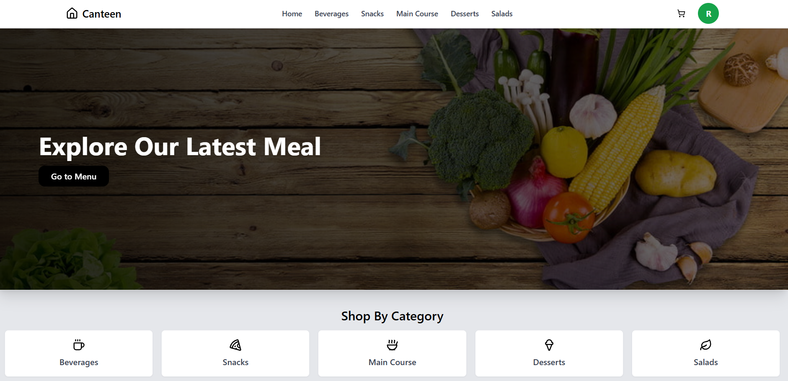
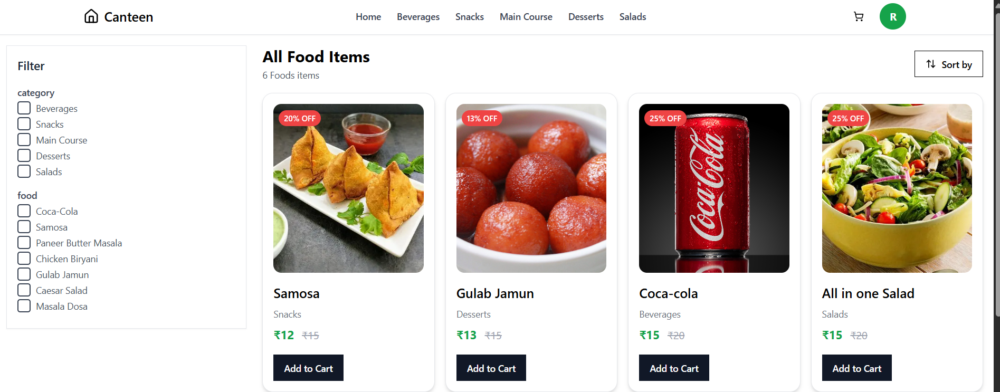
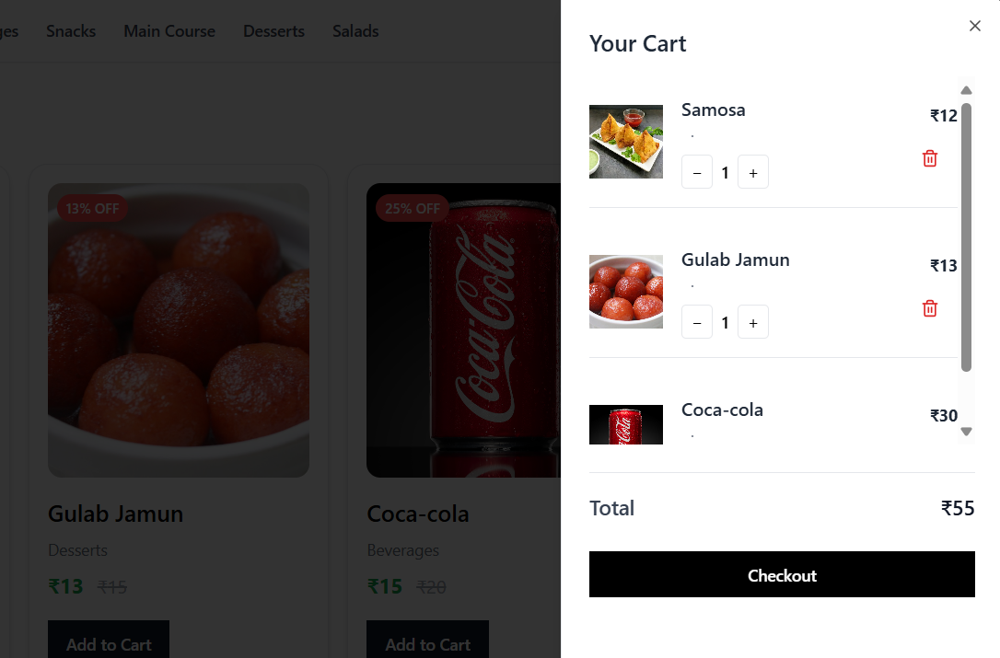
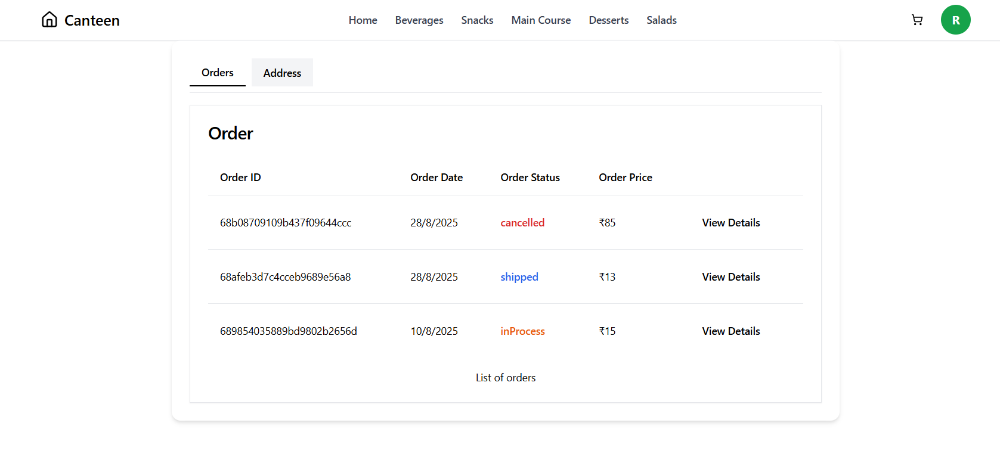
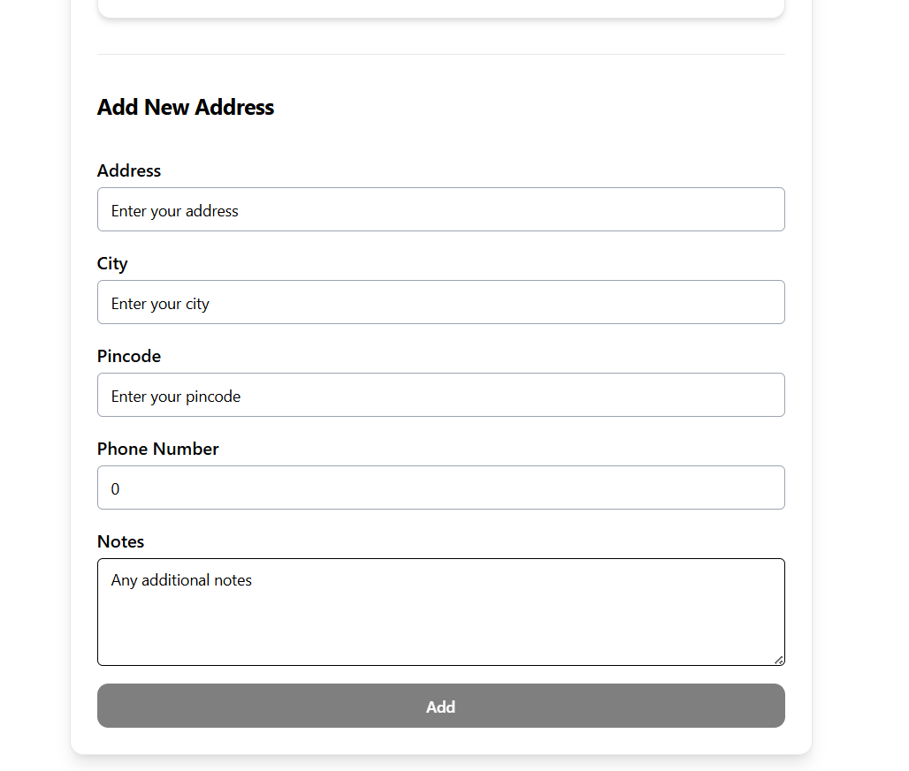
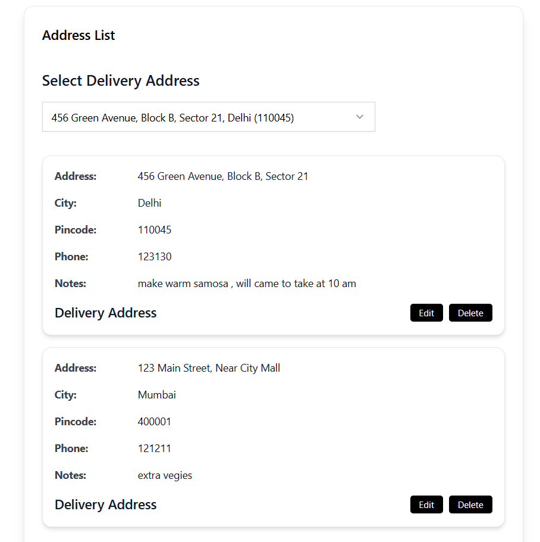
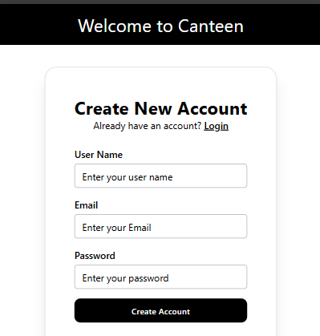
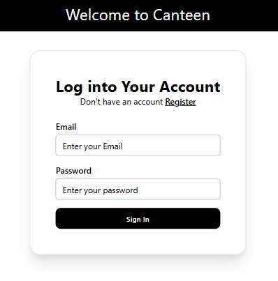

# Project Screenshots

## User Layout (After Login as User)

 ### Home Page
 

 ### Menu Page
 

 ### User Cart
 

 ### User Order Status
  

 ### User's Address
 | Add Address | Edit Adress |
|-----------|------------|
|  |  |

## Admin Layout (After Login as Admin)

### Admin Dashboard

### Admin CRUD Food items

### Admin Control of Order List

## Login/Register

| Register Page | Login Page |
|-----------|------------|
|  |  |

